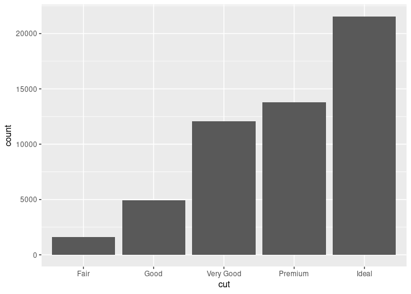

# Exploratory data analysis with the tidyverse

## Workflow


<https://r4ds.had.co.nz/introduction.html>

## Toolkit


<https://www.tidyverse.org/>

``` r
library(tidyverse)
#> ── Attaching packages ─────────────────────────────────────── tidyverse 1.3.1 ──
#> ✓ ggplot2 3.3.5     ✓ purrr   0.3.4
#> ✓ tibble  3.1.5     ✓ dplyr   1.0.7
#> ✓ tidyr   1.1.4     ✓ stringr 1.4.0
#> ✓ readr   2.0.2     ✓ forcats 0.5.1
#> ── Conflicts ────────────────────────────────────────── tidyverse_conflicts() ──
#> x dplyr::filter() masks stats::filter()
#> x dplyr::lag()    masks stats::lag()
```

### Tidy data

> Tidy datasets are easy to manipulate, model and visualise, and have a
> specific structure: each variable is a column, each observation is a
> row. – <https://vita.had.co.nz/papers/tidy-data.pdf>


``` r
diamonds
#> # A tibble: 53,940 × 10
#>    carat cut       color clarity depth table price     x     y     z
#>    <dbl> <ord>     <ord> <ord>   <dbl> <dbl> <int> <dbl> <dbl> <dbl>
#>  1  0.23 Ideal     E     SI2      61.5    55   326  3.95  3.98  2.43
#>  2  0.21 Premium   E     SI1      59.8    61   326  3.89  3.84  2.31
#>  3  0.23 Good      E     VS1      56.9    65   327  4.05  4.07  2.31
#>  4  0.29 Premium   I     VS2      62.4    58   334  4.2   4.23  2.63
#>  5  0.31 Good      J     SI2      63.3    58   335  4.34  4.35  2.75
#>  6  0.24 Very Good J     VVS2     62.8    57   336  3.94  3.96  2.48
#>  7  0.24 Very Good I     VVS1     62.3    57   336  3.95  3.98  2.47
#>  8  0.26 Very Good H     SI1      61.9    55   337  4.07  4.11  2.53
#>  9  0.22 Fair      E     VS2      65.1    61   337  3.87  3.78  2.49
#> 10  0.23 Very Good H     VS1      59.4    61   338  4     4.05  2.39
#> # … with 53,930 more rows
```

### Visualize data with ggplot


Template:

    ggplot(data = <DATA>) +
      <GEOM_FUNCTION>(mapping = aes(<MAPPINGS>))

Example:

``` r
ggplot(data = diamonds) +
  geom_bar(mapping = aes(x = cut))
```

<!-- -->

<https://ggplot2.tidyverse.org/>

### Data transformation with dplyr

The main verbs:

-   `mutate()` adds columns.
-   `select()` picks columns.
-   `count()` count observations by group.

<https://dplyr.tidyverse.org/>

Example:

``` r
arrange(diamonds, price)
#> # A tibble: 53,940 × 10
#>    carat cut       color clarity depth table price     x     y     z
#>    <dbl> <ord>     <ord> <ord>   <dbl> <dbl> <int> <dbl> <dbl> <dbl>
#>  1  0.23 Ideal     E     SI2      61.5    55   326  3.95  3.98  2.43
#>  2  0.21 Premium   E     SI1      59.8    61   326  3.89  3.84  2.31
#>  3  0.23 Good      E     VS1      56.9    65   327  4.05  4.07  2.31
#>  4  0.29 Premium   I     VS2      62.4    58   334  4.2   4.23  2.63
#>  5  0.31 Good      J     SI2      63.3    58   335  4.34  4.35  2.75
#>  6  0.24 Very Good J     VVS2     62.8    57   336  3.94  3.96  2.48
#>  7  0.24 Very Good I     VVS1     62.3    57   336  3.95  3.98  2.47
#>  8  0.26 Very Good H     SI1      61.9    55   337  4.07  4.11  2.53
#>  9  0.22 Fair      E     VS2      65.1    61   337  3.87  3.78  2.49
#> 10  0.23 Very Good H     VS1      59.4    61   338  4     4.05  2.39
#> # … with 53,930 more rows

# Same
diamonds %>% arrange(price)
#> # A tibble: 53,940 × 10
#>    carat cut       color clarity depth table price     x     y     z
#>    <dbl> <ord>     <ord> <ord>   <dbl> <dbl> <int> <dbl> <dbl> <dbl>
#>  1  0.23 Ideal     E     SI2      61.5    55   326  3.95  3.98  2.43
#>  2  0.21 Premium   E     SI1      59.8    61   326  3.89  3.84  2.31
#>  3  0.23 Good      E     VS1      56.9    65   327  4.05  4.07  2.31
#>  4  0.29 Premium   I     VS2      62.4    58   334  4.2   4.23  2.63
#>  5  0.31 Good      J     SI2      63.3    58   335  4.34  4.35  2.75
#>  6  0.24 Very Good J     VVS2     62.8    57   336  3.94  3.96  2.48
#>  7  0.24 Very Good I     VVS1     62.3    57   336  3.95  3.98  2.47
#>  8  0.26 Very Good H     SI1      61.9    55   337  4.07  4.11  2.53
#>  9  0.22 Fair      E     VS2      65.1    61   337  3.87  3.78  2.49
#> 10  0.23 Very Good H     VS1      59.4    61   338  4     4.05  2.39
#> # … with 53,930 more rows

diamonds %>% 
  arrange(price) %>% 
  filter(price > 1000) %>% 
  select(color, cut)
#> # A tibble: 39,416 × 2
#>    color cut      
#>    <ord> <ord>    
#>  1 G     Very Good
#>  2 F     Ideal    
#>  3 E     Ideal    
#>  4 G     Ideal    
#>  5 G     Ideal    
#>  6 G     Ideal    
#>  7 G     Ideal    
#>  8 G     Ideal    
#>  9 E     Good     
#> 10 G     Fair     
#> # … with 39,406 more rows

diamonds %>% 
  count(cut)
#> # A tibble: 5 × 2
#>   cut           n
#>   <ord>     <int>
#> 1 Fair       1610
#> 2 Good       4906
#> 3 Very Good 12082
#> 4 Premium   13791
#> 5 Ideal     21551
```
