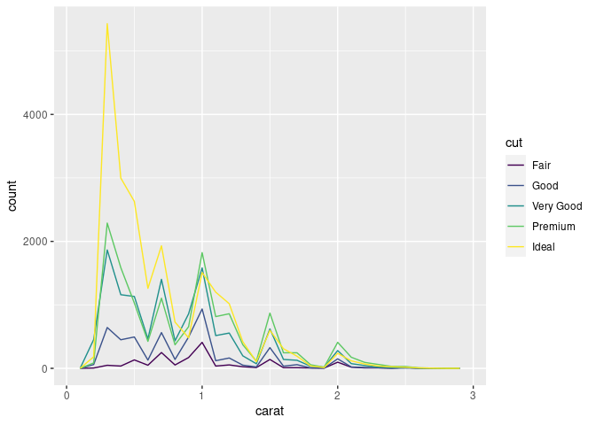
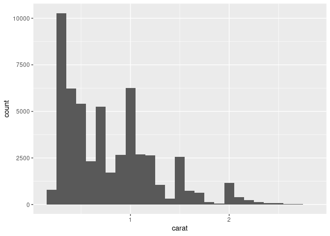

``` r
library(tidyverse)
#> ── Attaching packages ─────────────────────────────────────── tidyverse 1.3.1 ──
#> ✓ ggplot2 3.3.5     ✓ purrr   0.3.4
#> ✓ tibble  3.1.6     ✓ dplyr   1.0.7
#> ✓ tidyr   1.1.4     ✓ stringr 1.4.0
#> ✓ readr   2.0.2     ✓ forcats 0.5.1
#> ── Conflicts ────────────────────────────────────────── tidyverse_conflicts() ──
#> x dplyr::filter() masks stats::filter()
#> x dplyr::lag()    masks stats::lag()
```

### Questions

-   An exploratory Data Analysis (EDA) helps you understand your data.

-   Use **questions** as tools to help you focus on a specific part of
    your data.

-   Two types of questions are always useful:

    1.  What type of **variation** occurs within my variables?

    2.  What type of **covariation** occurs between my variables?

### Definitions

-   Variable \~ column.

-   Value \~ cell.

-   Observation \~ row.

-   Tabular data \~ spreadsheet.

-   Tidy data ([paper](https://vita.had.co.nz/papers/tidy-data.pdf),
    [tidyr](https://tidyr.tidyverse.org/) package).

> Tidy datasets are easy to manipulate, model and visualise, and have a
> specific structure: each variable is a column, each observation is a
> row.


Example:

``` r
diamonds
#> # A tibble: 53,940 × 10
#>    carat cut       color clarity depth table price     x     y     z
#>    <dbl> <ord>     <ord> <ord>   <dbl> <dbl> <int> <dbl> <dbl> <dbl>
#>  1  0.23 Ideal     E     SI2      61.5    55   326  3.95  3.98  2.43
#>  2  0.21 Premium   E     SI1      59.8    61   326  3.89  3.84  2.31
#>  3  0.23 Good      E     VS1      56.9    65   327  4.05  4.07  2.31
#>  4  0.29 Premium   I     VS2      62.4    58   334  4.2   4.23  2.63
#>  5  0.31 Good      J     SI2      63.3    58   335  4.34  4.35  2.75
#>  6  0.24 Very Good J     VVS2     62.8    57   336  3.94  3.96  2.48
#>  7  0.24 Very Good I     VVS1     62.3    57   336  3.95  3.98  2.47
#>  8  0.26 Very Good H     SI1      61.9    55   337  4.07  4.11  2.53
#>  9  0.22 Fair      E     VS2      65.1    61   337  3.87  3.78  2.49
#> 10  0.23 Very Good H     VS1      59.4    61   338  4     4.05  2.39
#> # … with 53,930 more rows
```

### Variation

Variation: The tendency of the values of a variable to change from
measurement to measurement.

-   Every variable has its own pattern of variation.

-   Plotting the distribution of a variable helps you understand that
    pattern.

#### Exploring the distribution of categorical variables

A categorical variable can only take one of a small set of values.

``` r
diamonds %>%
  relocate(cut)
#> # A tibble: 53,940 × 10
#>    cut       carat color clarity depth table price     x     y     z
#>    <ord>     <dbl> <ord> <ord>   <dbl> <dbl> <int> <dbl> <dbl> <dbl>
#>  1 Ideal      0.23 E     SI2      61.5    55   326  3.95  3.98  2.43
#>  2 Premium    0.21 E     SI1      59.8    61   326  3.89  3.84  2.31
#>  3 Good       0.23 E     VS1      56.9    65   327  4.05  4.07  2.31
#>  4 Premium    0.29 I     VS2      62.4    58   334  4.2   4.23  2.63
#>  5 Good       0.31 J     SI2      63.3    58   335  4.34  4.35  2.75
#>  6 Very Good  0.24 J     VVS2     62.8    57   336  3.94  3.96  2.48
#>  7 Very Good  0.24 I     VVS1     62.3    57   336  3.95  3.98  2.47
#>  8 Very Good  0.26 H     SI1      61.9    55   337  4.07  4.11  2.53
#>  9 Fair       0.22 E     VS2      65.1    61   337  3.87  3.78  2.49
#> 10 Very Good  0.23 H     VS1      59.4    61   338  4     4.05  2.39
#> # … with 53,930 more rows
```

Visualize:

``` r
ggplot(data = diamonds) +
  geom_bar(mapping = aes(x = cut))
```

<!-- -->

By hand:

``` r
diamonds %>% 
  count(cut)
#> # A tibble: 5 × 2
#>   cut           n
#>   <ord>     <int>
#> 1 Fair       1610
#> 2 Good       4906
#> 3 Very Good 12082
#> 4 Premium   13791
#> 5 Ideal     21551
```

A continuous variable can take any of an infinite set of ordered values.

``` r
diamonds %>% 
  relocate(carat)
#> # A tibble: 53,940 × 10
#>    carat cut       color clarity depth table price     x     y     z
#>    <dbl> <ord>     <ord> <ord>   <dbl> <dbl> <int> <dbl> <dbl> <dbl>
#>  1  0.23 Ideal     E     SI2      61.5    55   326  3.95  3.98  2.43
#>  2  0.21 Premium   E     SI1      59.8    61   326  3.89  3.84  2.31
#>  3  0.23 Good      E     VS1      56.9    65   327  4.05  4.07  2.31
#>  4  0.29 Premium   I     VS2      62.4    58   334  4.2   4.23  2.63
#>  5  0.31 Good      J     SI2      63.3    58   335  4.34  4.35  2.75
#>  6  0.24 Very Good J     VVS2     62.8    57   336  3.94  3.96  2.48
#>  7  0.24 Very Good I     VVS1     62.3    57   336  3.95  3.98  2.47
#>  8  0.26 Very Good H     SI1      61.9    55   337  4.07  4.11  2.53
#>  9  0.22 Fair      E     VS2      65.1    61   337  3.87  3.78  2.49
#> 10  0.23 Very Good H     VS1      59.4    61   338  4     4.05  2.39
#> # … with 53,930 more rows
```

Visualize:

``` r
ggplot(data = diamonds) +
  geom_histogram(mapping = aes(x = carat), binwidth = 0.5)
```

<!-- -->

By hand:

``` r
diamonds %>% 
  count(cut_width(carat, 0.5))
#> # A tibble: 11 × 2
#>    `cut_width(carat, 0.5)`     n
#>    <fct>                   <int>
#>  1 [-0.25,0.25]              785
#>  2 (0.25,0.75]             29498
#>  3 (0.75,1.25]             15977
#>  4 (1.25,1.75]              5313
#>  5 (1.75,2.25]              2002
#>  6 (2.25,2.75]               322
#>  7 (2.75,3.25]                32
#>  8 (3.25,3.75]                 5
#>  9 (3.75,4.25]                 4
#> 10 (4.25,4.75]                 1
#> 11 (4.75,5.25]                 1
```

-   Tip: Different binwidths can reveal different patterns.

``` r
smaller <- diamonds %>% 
  filter(carat < 3)
  
ggplot(data = smaller, mapping = aes(x = carat)) +
  geom_histogram(binwidth = 0.1)
```

<!-- -->

-   Overlay multiple histograms in the same plot:`geom_freqpoly()`.

``` r
ggplot(data = smaller, mapping = aes(x = carat, colour = cut)) +
  geom_freqpoly(binwidth = 0.1)
```

<!-- -->

### Resources

-   [R for data science (book)](https://r4ds.had.co.nz/index.html).

-   [ggplot2](https://ggplot2.tidyverse.org/):

    -   [Template](https://r4ds.had.co.nz/data-visualisation.html#a-graphing-template).

    -   [Reference](https://ggplot2.tidyverse.org/reference/index.html).

    -   [Cheatsheet](https://ggplot2.tidyverse.org/index.html#cheatsheet).

-   [dplyr](https://dplyr.tidyverse.org/):

    -   [Reference](https://dplyr.tidyverse.org/reference/index.html).
