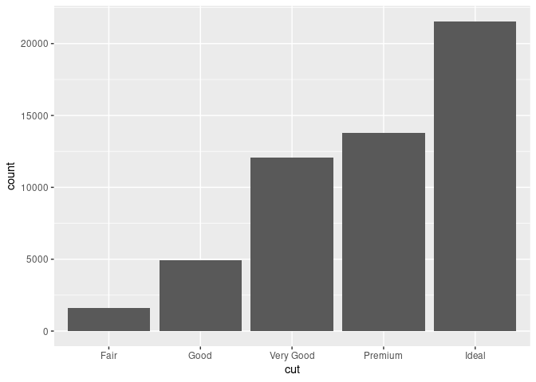
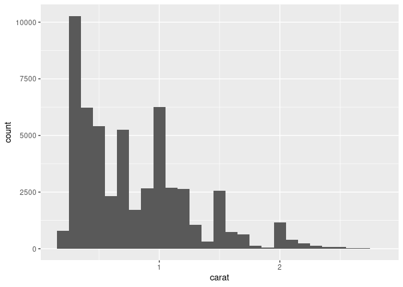

``` r
library(tidyverse, warn.conflicts = FALSE)
#> ── Attaching packages ─────────────────────────────────────── tidyverse 1.3.1 ──
#> ✓ ggplot2 3.3.5     ✓ purrr   0.3.4
#> ✓ tibble  3.1.6     ✓ dplyr   1.0.7
#> ✓ tidyr   1.1.4     ✓ stringr 1.4.0
#> ✓ readr   2.0.2     ✓ forcats 0.5.1
#> ── Conflicts ────────────────────────────────────────── tidyverse_conflicts() ──
#> x dplyr::filter() masks stats::filter()
#> x dplyr::lag()    masks stats::lag()
```

### Questions

Exploratory Data Analysis (EDA):

-   Why? To understand your data.

-   How? Using **questions** as tools to focus on a specific part of
    your data.

Questions that are always useful:

-   What type of **variation** occurs within my variables?

-   What type of **covariation** occurs between my variables?

### Definitions

-   Variable \~ column.

-   Value \~ cell.

-   Observation \~ row.

-   Tabular data \~ spreadsheet.

-   Tidy data ([paper](https://vita.had.co.nz/papers/tidy-data.pdf),
    [tidyr](https://tidyr.tidyverse.org/) package).

> Tidy datasets are easy to manipulate, model and visualise, and have a
> specific structure: each variable is a column, each observation is a
> row.


### Variation

Variation: The tendency of the values of a variable to change from
measurement to measurement.

-   Every variable has its own pattern of variation.

-   Plotting the distribution of a variable helps you understand that
    pattern.

#### Exploring the distribution of categorical variables

A categorical variable can only take one of a small set of values.

``` r
ggplot(data = diamonds) +
  geom_bar(mapping = aes(x = cut))
```

<!-- -->

By hand:

``` r
diamonds %>% 
  count(cut)
#> # A tibble: 5 × 2
#>   cut           n
#>   <ord>     <int>
#> 1 Fair       1610
#> 2 Good       4906
#> 3 Very Good 12082
#> 4 Premium   13791
#> 5 Ideal     21551
```

A continuous variable can take any of an infinite set of ordered values.

``` r
ggplot(data = diamonds) +
  geom_histogram(mapping = aes(x = carat), binwidth = 0.5)
```

<!-- -->

By hand:

``` r
diamonds %>% 
  count(cut_width(carat, 0.5))
#> # A tibble: 11 × 2
#>    `cut_width(carat, 0.5)`     n
#>    <fct>                   <int>
#>  1 [-0.25,0.25]              785
#>  2 (0.25,0.75]             29498
#>  3 (0.75,1.25]             15977
#>  4 (1.25,1.75]              5313
#>  5 (1.75,2.25]              2002
#>  6 (2.25,2.75]               322
#>  7 (2.75,3.25]                32
#>  8 (3.25,3.75]                 5
#>  9 (3.75,4.25]                 4
#> 10 (4.25,4.75]                 1
#> 11 (4.75,5.25]                 1
```

-   Tip: Different binwidths can reveal different patterns.

``` r
smaller <- diamonds %>% 
  filter(carat < 3)
  
ggplot(data = smaller, mapping = aes(x = carat)) +
  geom_histogram(binwidth = 0.1)
```

<!-- -->

-   Overlay multiple histograms in the same plot:`geom_freqpoly()`.

``` r
ggplot(data = smaller, mapping = aes(x = carat, colour = cut)) +
  geom_freqpoly(binwidth = 0.1)
```

<!-- -->
