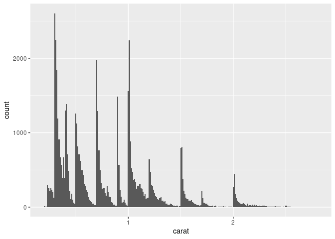

Packages.

``` r
library(tidyverse)
#> ── Attaching packages ─────────────────────────────────────── tidyverse 1.3.1 ──
#> ✓ ggplot2 3.3.5     ✓ purrr   0.3.4
#> ✓ tibble  3.1.6     ✓ dplyr   1.0.7
#> ✓ tidyr   1.1.4     ✓ stringr 1.4.0
#> ✓ readr   2.0.2     ✓ forcats 0.5.1
#> ── Conflicts ────────────────────────────────────────── tidyverse_conflicts() ──
#> x dplyr::filter() masks stats::filter()
#> x dplyr::lag()    masks stats::lag()
```

Data.

`?diamonds`:

-   `price`: price in US dollars.
-   `carat`: weight of the diamond (0.2–5.01).
-   `x, y, z`: length, width, depth in mm.

``` r
diamonds %>% 
  select(price, carat, x, y, z)
#> # A tibble: 53,940 × 5
#>    price carat     x     y     z
#>    <int> <dbl> <dbl> <dbl> <dbl>
#>  1   326  0.23  3.95  3.98  2.43
#>  2   326  0.21  3.89  3.84  2.31
#>  3   327  0.23  4.05  4.07  2.31
#>  4   334  0.29  4.2   4.23  2.63
#>  5   335  0.31  4.34  4.35  2.75
#>  6   336  0.24  3.94  3.96  2.48
#>  7   336  0.24  3.95  3.98  2.47
#>  8   337  0.26  4.07  4.11  2.53
#>  9   337  0.22  3.87  3.78  2.49
#> 10   338  0.23  4     4.05  2.39
#> # … with 53,930 more rows
```

An overview.

``` r
diamonds %>% 
  glimpse()
#> Rows: 53,940
#> Columns: 10
#> $ carat   <dbl> 0.23, 0.21, 0.23, 0.29, 0.31, 0.24, 0.24, 0.26, 0.22, 0.23, 0.…
#> $ cut     <ord> Ideal, Premium, Good, Premium, Good, Very Good, Very Good, Ver…
#> $ color   <ord> E, E, E, I, J, J, I, H, E, H, J, J, F, J, E, E, I, J, J, J, I,…
#> $ clarity <ord> SI2, SI1, VS1, VS2, SI2, VVS2, VVS1, SI1, VS2, VS1, SI1, VS1, …
#> $ depth   <dbl> 61.5, 59.8, 56.9, 62.4, 63.3, 62.8, 62.3, 61.9, 65.1, 59.4, 64…
#> $ table   <dbl> 55, 61, 65, 58, 58, 57, 57, 55, 61, 61, 55, 56, 61, 54, 62, 58…
#> $ price   <int> 326, 326, 327, 334, 335, 336, 336, 337, 337, 338, 339, 340, 34…
#> $ x       <dbl> 3.95, 3.89, 4.05, 4.20, 4.34, 3.94, 3.95, 4.07, 3.87, 4.00, 4.…
#> $ y       <dbl> 3.98, 3.84, 4.07, 4.23, 4.35, 3.96, 3.98, 4.11, 3.78, 4.05, 4.…
#> $ z       <dbl> 2.43, 2.31, 2.31, 2.63, 2.75, 2.48, 2.47, 2.53, 2.49, 2.39, 2.…
```

### Visualize the most common and rare values in a dataset

What a bar chart or histogram can tell you:

-   Tall bars show common values.

-   Shorter bars show less-common values.

-   No bars reveal values that were not seen in your data.

General questions:

-   Which values are the most common? Why?

-   Which values are rare? Why? Does that match your expectations?

-   Can you see any unusual patterns? What might explain them?

Specific questions for the plot below:

-   Why are there more diamonds at whole carats and common fractions of
    carats?

-   Why are there more diamonds slightly to the right of each peak than
    there are slightly to the left of each peak?

``` r
smaller <- diamonds %>% 
  filter(carat < 3)

ggplot(data = smaller, mapping = aes(x = carat)) +
  geom_histogram(binwidth = 0.01)
```

<!-- -->

Clusters of similar values suggest that subgroups exist in your data. To
understand the subgroups, ask:

-   How are the observations within each cluster similar to each other?

-   How are the observations in separate clusters different from each
    other?

-   Why might the appearance of clusters be misleading? (Consider
    bin-width.)
