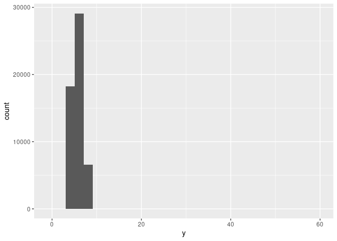
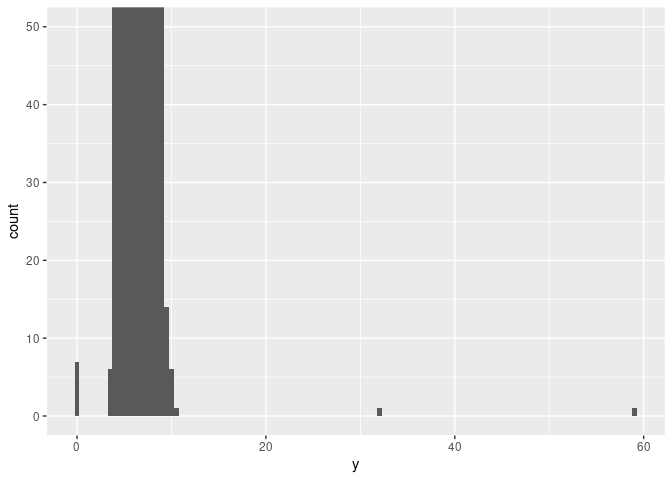
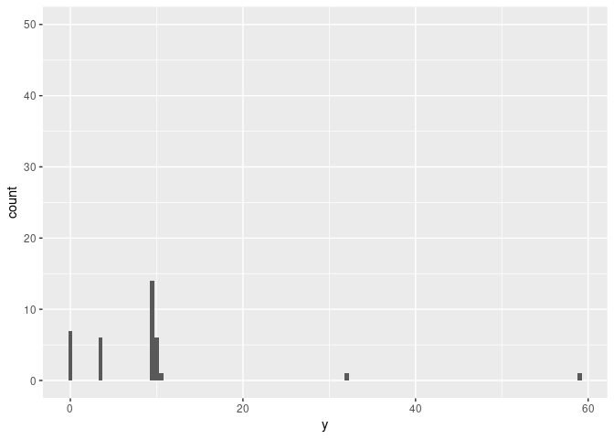
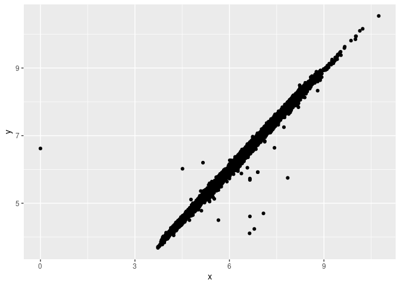
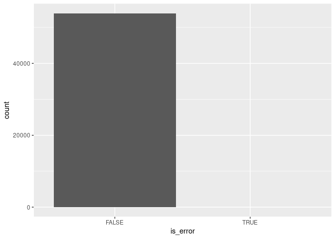
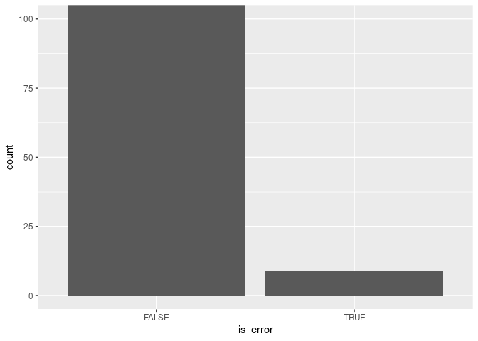

Packages.

``` r
library(tidyverse)
#> ── Attaching packages ─────────────────────────────────────── tidyverse 1.3.1 ──
#> ✓ ggplot2 3.3.5     ✓ purrr   0.3.4
#> ✓ tibble  3.1.6     ✓ dplyr   1.0.7
#> ✓ tidyr   1.1.4     ✓ stringr 1.4.0
#> ✓ readr   2.0.2     ✓ forcats 0.5.1
#> ── Conflicts ────────────────────────────────────────── tidyverse_conflicts() ──
#> x dplyr::filter() masks stats::filter()
#> x dplyr::lag()    masks stats::lag()
```

Data.

``` r
diamonds %>% 
  select(price, carat, x, y, z)
#> # A tibble: 53,940 × 5
#>    price carat     x     y     z
#>    <int> <dbl> <dbl> <dbl> <dbl>
#>  1   326  0.23  3.95  3.98  2.43
#>  2   326  0.21  3.89  3.84  2.31
#>  3   327  0.23  4.05  4.07  2.31
#>  4   334  0.29  4.2   4.23  2.63
#>  5   335  0.31  4.34  4.35  2.75
#>  6   336  0.24  3.94  3.96  2.48
#>  7   336  0.24  3.95  3.98  2.47
#>  8   337  0.26  4.07  4.11  2.53
#>  9   337  0.22  3.87  3.78  2.49
#> 10   338  0.23  4     4.05  2.39
#> # … with 53,930 more rows
```

### Explore outliers analytically, and by zooming into a plot

Outliers:

-   Unusual data.
-   They don’t seem to fit the pattern.
-   May be data-entry errors.

Example:

-   Why are the limits of the `y` axis so wide?

``` r
ggplot(diamonds) + 
  geom_histogram(mapping = aes(x = y), binwidth = 0.5)
```

<!-- -->

Let’s zoom in! Can you now see what’s going on?

``` r
ggplot(diamonds) + 
  geom_histogram(mapping = aes(x = y), binwidth = 0.5) +
  coord_cartesian(ylim = c(0, 50))
```

<!-- -->

Here is another way to “zoom in”. Why in this case it isn’t a good way?

``` r
ggplot(diamonds) + 
  geom_histogram(mapping = aes(x = y), binwidth = 0.5) +
  ylim(c(0, 50))
#> Warning: Removed 11 rows containing missing values (geom_bar).
```

<!-- -->

Let’s now explore those outliers analytically. Can you see why they are
errors?

``` r
unusual <- diamonds %>% 
  filter(y < 3 | y > 20) %>% 
  select(price, x, y, z) %>%
  arrange(y)
unusual
#> # A tibble: 9 × 4
#>   price     x     y     z
#>   <int> <dbl> <dbl> <dbl>
#> 1  5139  0      0    0   
#> 2  6381  0      0    0   
#> 3 12800  0      0    0   
#> 4 15686  0      0    0   
#> 5 18034  0      0    0   
#> 6  2130  0      0    0   
#> 7  2130  0      0    0   
#> 8  2075  5.15  31.8  5.12
#> 9 12210  8.09  58.9  8.06
```

Tip: Repeat your analysis with and without the outliers:

-   If they have substantial effect, only drop them if you can justify.

-   If they have minimal effect, you can can replace them with missing
    values.

### Transforming incorrect values into missing values

How can you remove data-entry errors?

1.  Remove the entire row. Why this may not be a good idea?

``` r
diamonds2 <- diamonds %>% 
  filter(between(y, 3, 20))
```

2.  Replace them with missing values.

``` r
diamonds2 <- diamonds %>% 
  mutate(y = ifelse(y < 3 | y > 20, NA, y))
```

Note the warning:

``` r
ggplot(data = diamonds2, mapping = aes(x = x, y = y)) + 
  geom_point()
#> Warning: Removed 9 rows containing missing values (geom_point).
```

<!-- -->

### Convert missing values into a logical variable so you can visualize them

Convert missing values into logical values, then visualize them.

``` r
diamonds3 <- diamonds2 %>% 
  mutate(is_error = is.na(y))

ggplot(diamonds3) +
  geom_bar(aes(is_error))
```

<!-- -->

Zoom in.

``` r
diamonds3 %>% 
  count(is_error)
#> # A tibble: 2 × 2
#>   is_error     n
#>   <lgl>    <int>
#> 1 FALSE    53931
#> 2 TRUE         9

ggplot(diamonds3) +
  geom_bar(aes(is_error)) +
  coord_cartesian(ylim = c(0, 100))
```

<!-- -->
