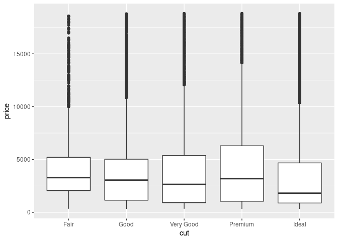
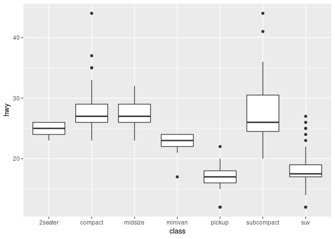
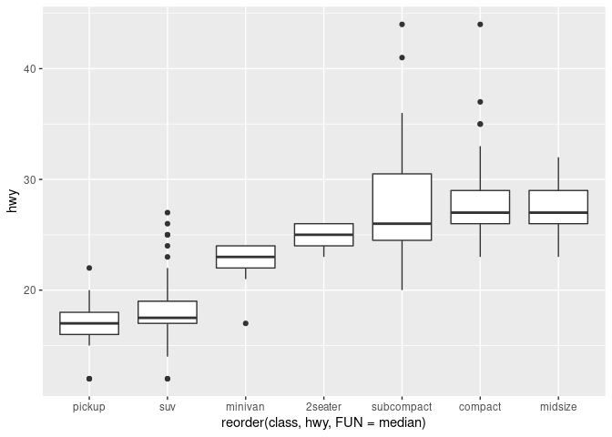

# Covariation

-   The tendency for two or more variables to vary together in a related
    way.

-   To spot covariation, visualise the relationship between the
    variables.

-   How? It depends on whether the variables are categorical or
    continuous.

Packages.

``` r
library(tidyverse)
#> ── Attaching packages ─────────────────────────────────────── tidyverse 1.3.1 ──
#> ✓ ggplot2 3.3.5     ✓ purrr   0.3.4
#> ✓ tibble  3.1.6     ✓ dplyr   1.0.7
#> ✓ tidyr   1.1.4     ✓ stringr 1.4.0
#> ✓ readr   2.1.1     ✓ forcats 0.5.1
#> ── Conflicts ────────────────────────────────────────── tidyverse_conflicts() ──
#> x dplyr::filter() masks stats::filter()
#> x dplyr::lag()    masks stats::lag()
```

Data.

``` r
diamonds %>% 
  select(price, cut)
#> # A tibble: 53,940 × 2
#>    price cut      
#>    <int> <ord>    
#>  1   326 Ideal    
#>  2   326 Premium  
#>  3   327 Good     
#>  4   334 Premium  
#>  5   335 Good     
#>  6   336 Very Good
#>  7   336 Very Good
#>  8   337 Very Good
#>  9   337 Fair     
#> 10   338 Very Good
#> # … with 53,930 more rows
```

``` r
mpg %>% 
  select(class, hwy)
#> # A tibble: 234 × 2
#>    class     hwy
#>    <chr>   <int>
#>  1 compact    29
#>  2 compact    29
#>  3 compact    31
#>  4 compact    30
#>  5 compact    26
#>  6 compact    26
#>  7 compact    27
#>  8 compact    26
#>  9 compact    25
#> 10 compact    28
#> # … with 224 more rows
```

### A categorical and continuous variable.

#### Freaquency plot

This isn’t very useful.

``` r
ggplot(data = diamonds) + 
  geom_freqpoly(mapping = aes(x = price, colour = cut))
```

Same

``` r
ggplot(diamonds) + 
  geom_freqpoly(aes(x = price, colour = cut))
#> `stat_bin()` using `bins = 30`. Pick better value with `binwidth`.
```

<!-- --> The variation
of count across values of cut is too much. To make the comparison easier
we need to standardize the valyes of `y`. Let’s plot density: The count
standardize so that the area under each curve is one.

``` r
ggplot(diamonds) + 
  geom_freqpoly(aes(x = price, y = ..density.., colour = cut))
#> `stat_bin()` using `bins = 30`. Pick better value with `binwidth`.
```

<!-- -->

Surprisingly, fair diamonds (the lowest quality) seem to have the
highest average price!

#### Box plot


``` r
ggplot(diamonds, aes(x = cut, y = price)) +
  geom_boxplot()
```

<!-- -->

-   The boxplots are compact so we can more easily compare them.

-   Are better quality diamonds cheaper on average?

–

-   `cut` is an “ordered” factor.

-   `hwy` (Highway miles per gallon) isn’t ordered so the trend is hard
    to see:

``` r
default_aes <- aes(
  x = class,
  y = hwy
)
default_aes
#> Aesthetic mapping: 
#> * `x` -> `class`
#> * `y` -> `hwy`
```

``` r
ggplot(mpg) +
  geom_boxplot(default_aes)
```

<!-- -->

`reorder()` helps you order values of a categorical variable like `cut`.

``` r
reordered_aes <- aes(
  x = reorder(class, hwy, FUN = median),
  y = hwy
)
reordered_aes
#> Aesthetic mapping: 
#> * `x` -> `reorder(class, hwy, FUN = median)`
#> * `y` -> `hwy`
```

``` r
p <- ggplot(mpg) +
  geom_boxplot(reordered_aes)
p
```

<!-- -->

If you have long variable names you may better flip the plot.

``` r
p + coord_flip()
```

<!-- -->
