### Setup

``` r
library(tidyverse)
#> ── Attaching packages ─────────────────────────────────────── tidyverse 1.3.1 ──
#> ✓ ggplot2 3.3.5     ✓ purrr   0.3.4
#> ✓ tibble  3.1.6     ✓ dplyr   1.0.7
#> ✓ tidyr   1.1.4     ✓ stringr 1.4.0
#> ✓ readr   2.1.1     ✓ forcats 0.5.1
#> ── Conflicts ────────────────────────────────────────── tidyverse_conflicts() ──
#> x dplyr::filter() masks stats::filter()
#> x dplyr::lag()    masks stats::lag()
```

# Covariation

-   The tendency for two or more variables to vary together in a related
    way.

-   To spot covariation, visualise the relationship between the
    variables.

-   How you do it depends on the type of variables you have:

    -   A categorical variable and a continuous variable.
    -   Two categorical variables.
    -   Two continuous variables.

### A categorical and continuous variable

``` r
diamonds %>% 
  select(cut, price)
#> # A tibble: 53,940 × 2
#>    cut       price
#>    <ord>     <int>
#>  1 Ideal       326
#>  2 Premium     326
#>  3 Good        327
#>  4 Premium     334
#>  5 Good        335
#>  6 Very Good   336
#>  7 Very Good   336
#>  8 Very Good   337
#>  9 Fair        337
#> 10 Very Good   338
#> # … with 53,930 more rows
```

#### Freaquency plot

``` r
ggplot(data = diamonds) + 
  geom_freqpoly(mapping = aes(x = price, colour = cut))
```

Same with “noise cancelling” turned on

``` r
ggplot(diamonds) + 
  geom_freqpoly(aes(x = price, colour = cut))
#> `stat_bin()` using `bins = 30`. Pick better value with `binwidth`.
```

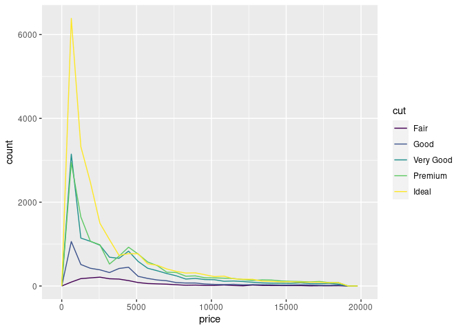<!-- -->

This isn’t very useful.

The variation of count across values of cut is too much.

To make the comparison easier we need to standardize the valyes of `y`.

Let’s plot density: The count standardize so that the area under each
curve is one.

``` r
ggplot(diamonds) + 
  geom_freqpoly(aes(x = price, y = ..density.., colour = cut))
#> `stat_bin()` using `bins = 30`. Pick better value with `binwidth`.
```

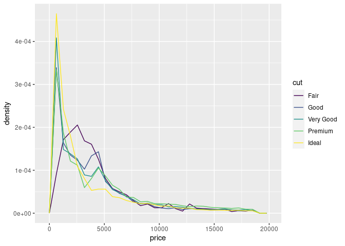<!-- -->

Surprisingly, fair diamonds (the lowest quality) seem to have the
highest average price!

#### Box plot


``` r
ggplot(diamonds, aes(x = cut, y = price)) +
  geom_boxplot()
```

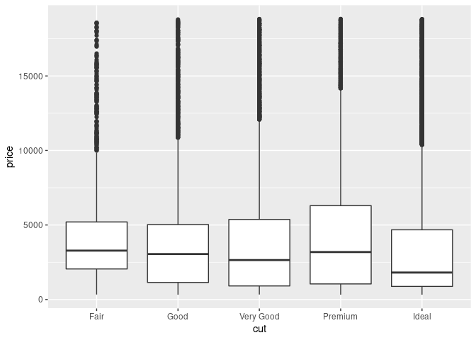<!-- -->

-   The boxplots are compact so we can more easily compare them.

-   Are better quality diamonds cheaper on average?

Note:

-   `cut` is an “ordered” factor.

``` r
diamonds %>% 
  distinct(cut) %>% 
  pull()
#> [1] Ideal     Premium   Good      Very Good Fair     
#> Levels: Fair < Good < Very Good < Premium < Ideal
```

-   Compare: In the `mpg` dataset, the variable `class` isn’t ordered.

``` r
mpg %>% 
  distinct(class) %>% 
  pull()
#> [1] "compact"    "midsize"    "suv"        "2seater"    "minivan"   
#> [6] "pickup"     "subcompact"
```

-   The trend is hard to see on how highway mileage (`hwy`) varies
    across classes:

``` r
class_hwy <- aes(
  x = class,
  y = hwy
)
class_hwy
#> Aesthetic mapping: 
#> * `x` -> `class`
#> * `y` -> `hwy`
```

``` r
ggplot(mpg) +
  geom_boxplot(class_hwy)
```

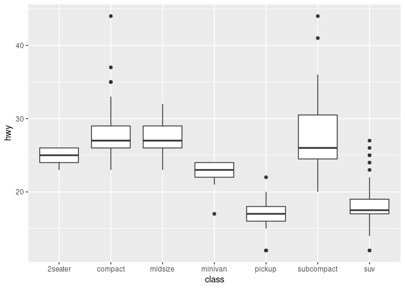<!-- -->

`reorder()` helps you order values of a categorical variable.

``` r
class_reordered_by_median_hwy <- aes(
  x = reorder(class, hwy, FUN = median),
  y = hwy
)
class_reordered_by_median_hwy
#> Aesthetic mapping: 
#> * `x` -> `reorder(class, hwy, FUN = median)`
#> * `y` -> `hwy`
```

``` r
p <- ggplot(mpg) +
  geom_boxplot(class_reordered_by_median_hwy)
p
```

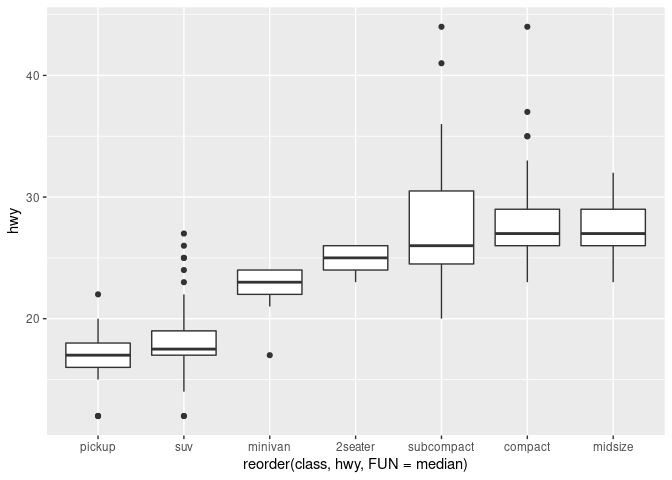<!-- -->

If you have long variable names you may better flip the plot.

``` r
p + coord_flip()
```

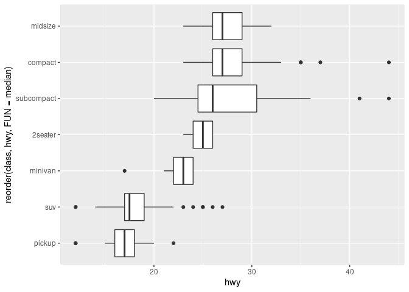<!-- -->

### Two categorical variables

Data:

-   `color`: Colour, ordered from D (best) to J (worst).
-   `cut`: Quality, ordered from Fair to Ideal.

``` r
diamonds %>% 
  select(color, cut)
#> # A tibble: 53,940 × 2
#>    color cut      
#>    <ord> <ord>    
#>  1 E     Ideal    
#>  2 E     Premium  
#>  3 E     Good     
#>  4 I     Premium  
#>  5 J     Good     
#>  6 J     Very Good
#>  7 I     Very Good
#>  8 H     Very Good
#>  9 E     Fair     
#> 10 H     Very Good
#> # … with 53,930 more rows
```

Two categorical variables, mapping count to area.

``` r
ggplot(diamonds) +
  geom_count(aes(color, cut))
```

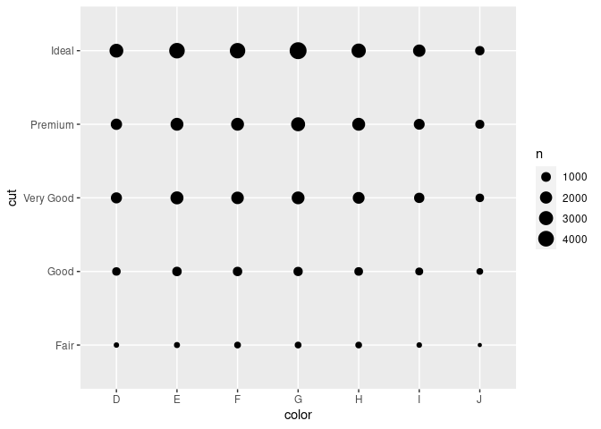<!-- -->

Two categorical variables, mapping count to colour fill.

``` r
diamonds %>% 
  count(color, cut) %>%  # Note the change from %>% to +
  ggplot() + 
    geom_tile(aes(color, cut, fill = n))
```

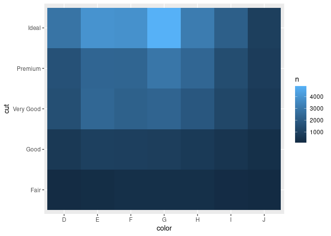<!-- -->

### Two continuous variables

Data:

-   `carat`: Weight.
-   `price`: Price.

``` r
diamonds %>% 
  select(carat, price)
#> # A tibble: 53,940 × 2
#>    carat price
#>    <dbl> <int>
#>  1  0.23   326
#>  2  0.21   326
#>  3  0.23   327
#>  4  0.29   334
#>  5  0.31   335
#>  6  0.24   336
#>  7  0.24   336
#>  8  0.26   337
#>  9  0.22   337
#> 10  0.23   338
#> # … with 53,930 more rows
```

Two continuous variables, suffering overplotting.

``` r
ggplot(diamonds) +
  geom_point(aes(carat, price))
```

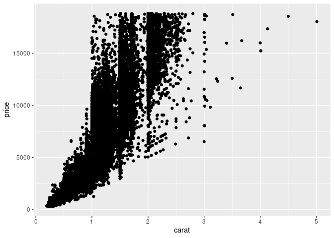<!-- -->

Solve over-plotting with transparency.

``` r
ggplot(diamonds) + 
  geom_point(aes(carat, price), alpha = 1 / 100)
```

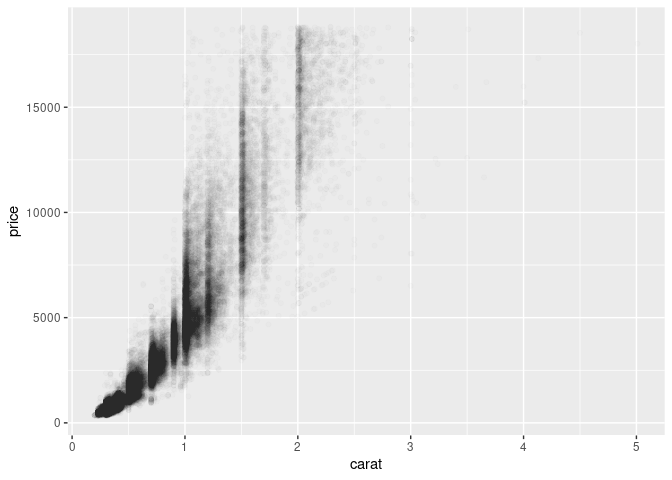<!-- -->

Use smaller data.

``` r
smaller <- diamonds %>% 
  filter(carat < 3)
```

Solve over-plotting with square bins.

``` r
ggplot(smaller) +
  geom_bin2d(aes(carat, price))
```

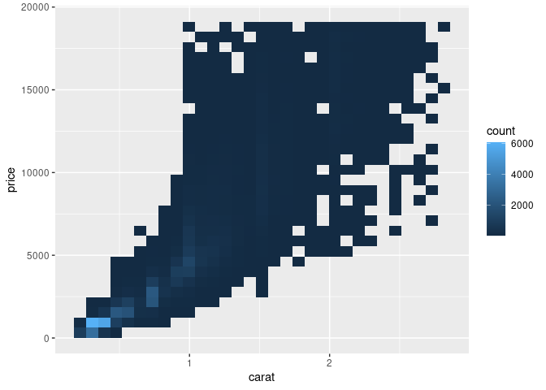<!-- -->

Solve over-plotting with hexagonal bins.

``` r
# install.packages("hexbin")
ggplot(smaller) +
  geom_hex(aes(carat, price))
```

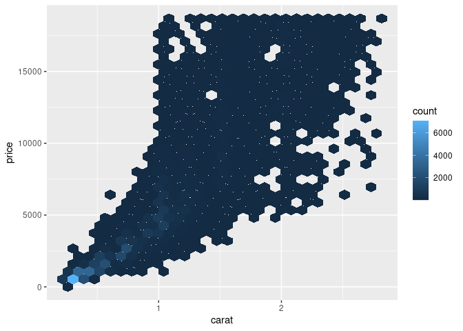<!-- -->

Categorize a continuous variable and visualize covariation with a
boxplot.

``` r
cut_carat <- smaller %>% 
  mutate(carat2 = cut_width(carat, 0.1)) %>% 
  select(price, carat, carat2) %>% 
  arrange(desc(carat))
cut_carat
#> # A tibble: 53,900 × 3
#>    price carat carat2     
#>    <int> <dbl> <fct>      
#>  1 15030  2.8  (2.75,2.85]
#>  2 18788  2.8  (2.75,2.85]
#>  3 10424  2.77 (2.75,2.85]
#>  4 13156  2.75 (2.65,2.75]
#>  5 15415  2.75 (2.65,2.75]
#>  6  8807  2.74 (2.65,2.75]
#>  7 17164  2.74 (2.65,2.75]
#>  8 17184  2.74 (2.65,2.75]
#>  9  6870  2.72 (2.65,2.75]
#> 10 11594  2.72 (2.65,2.75]
#> # … with 53,890 more rows
```

``` r
ggplot(cut_carat) + 
  geom_boxplot(aes(carat2, price))
```

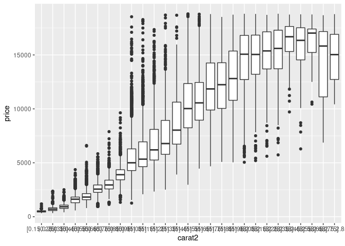<!-- -->

Similar.

``` r
ggplot(smaller) + 
  geom_boxplot(aes(carat, price, group = cut_width(carat, 0.1)))
```

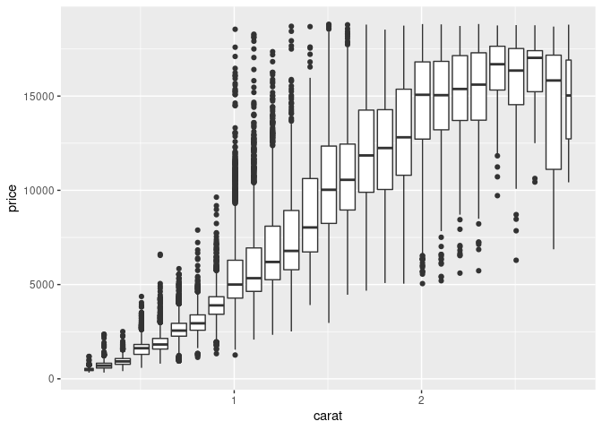<!-- -->

Map the width of a boxplot to the number of observations:

1.  Make the box-width proportional to the number of points in each bin.

``` r
ggplot(smaller) + 
  geom_boxplot(
    aes(carat, price, group = cut_width(carat, 0.1)), 
    varwidth = TRUE
  )
```

<!-- -->

2.  Display approximately the same number of points in each bin.

``` r
ggplot(smaller) + 
  geom_boxplot(aes(carat, price, group = cut_number(carat, 20)))
```

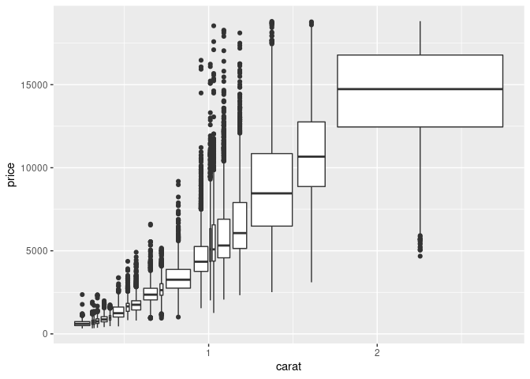<!-- -->
