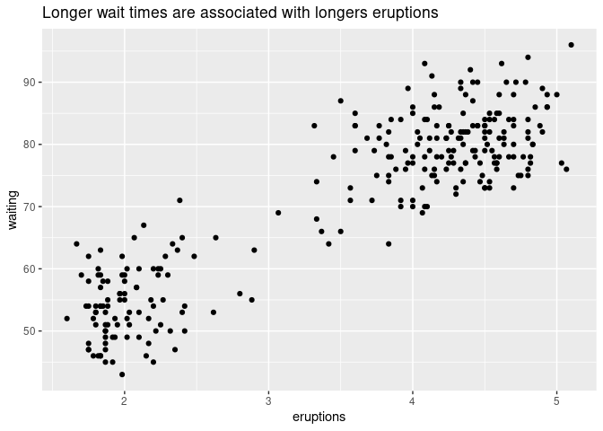
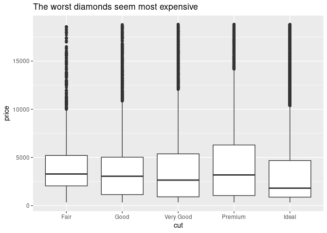
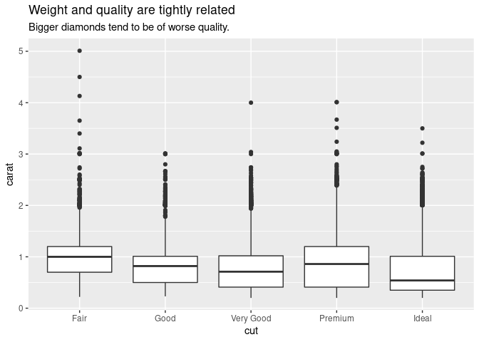
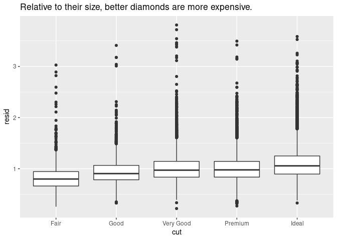
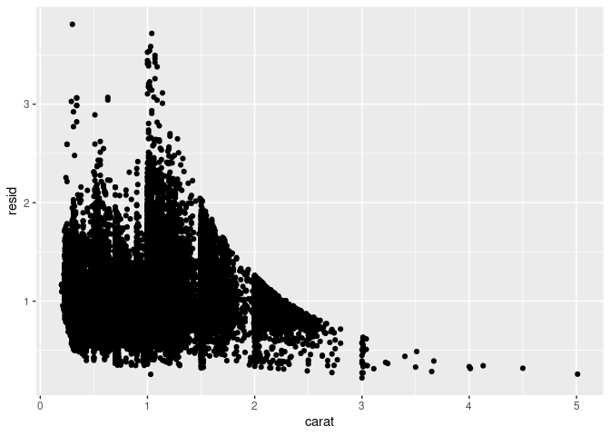

# Patterns and models

Patterns reveal covariation.

Models are a tool for extracting patterns out of data.

If you spot a pattern, ask yourself:

-   How can you describe the relationship implied by the pattern?

-   Could this pattern be due to coincidence (i.e. random chance)?

-   How strong is the relationship implied by the pattern?

-   What other variables might affect the relationship?

-   Does the relationship change if you look at individual subgroups of
    the data?

``` r
library(tidyverse)
#> ── Attaching packages ─────────────────────────────────────── tidyverse 1.3.1 ──
#> ✓ ggplot2 3.3.5     ✓ purrr   0.3.4
#> ✓ tibble  3.1.6     ✓ dplyr   1.0.7
#> ✓ tidyr   1.1.4     ✓ stringr 1.4.0
#> ✓ readr   2.1.1     ✓ forcats 0.5.1
#> ── Conflicts ────────────────────────────────────────── tidyverse_conflicts() ──
#> x dplyr::filter() masks stats::filter()
#> x dplyr::lag()    masks stats::lag()
library(modelr)
```

### Warm up

-   `eruptions`: Eruption time in mins.
-   `waiting` Waiting time to next eruption (in mins).

``` r
glimpse(faithful)
#> Rows: 272
#> Columns: 2
#> $ eruptions <dbl> 3.600, 1.800, 3.333, 2.283, 4.533, 2.883, 4.700, 3.600, 1.95…
#> $ waiting   <dbl> 79, 54, 74, 62, 85, 55, 88, 85, 51, 85, 54, 84, 78, 47, 83, …
```

``` r
ggplot(faithful, aes(eruptions, waiting)) + 
  geom_point() +
  labs(title = "Longer wait times are associated with longers eruptions")
```

<!-- -->

Remove the pattern and plot again

``` r
mod <- lm(waiting ~ eruptions, data = faithful)

faithful %>% 
  modelr::add_residuals(mod) %>%
  ggplot(aes(eruptions, resid)) + geom_point()
```

<!-- -->

### What is the relationship between price and quality?

``` r
ggplot(diamonds, aes(cut, price)) + 
  geom_boxplot() + 
  labs(title = "The worst diamonds seem most expensive")
```

<!-- -->

It’s hard to understand the relationship between `cut` (quality) and
`price` because …

``` r
ggplot(diamonds, aes(cut, carat)) + 
  geom_boxplot() +
  labs(
    title = "Weight and quality are tightly related",
    subtitle = "Bigger diamonds tend to be of worse quality."
  )
```

<!-- -->

and …

``` r
ggplot(diamonds, aes(carat, price)) + 
  geom_point() +
  labs(
    title = "Price and weight are tightly related",
    subtitle = "Bigger diamonds tend to be more expensive."
  )
```

<!-- -->

-   Remove the relationship between price and weight.
-   Explore price vs. quality again.

``` r
mod <- lm(log(price) ~ log(carat), data = diamonds)

diamonds2 <- diamonds %>% 
  add_residuals(mod) %>% 
  mutate(resid = exp(resid))
  
ggplot(diamonds2, aes(cut, resid)) + 
  geom_boxplot() +
  labs(title = "Relative to their size, better diamonds are more expensive.")
```

<!-- -->

### Insights

-   Patterns reveal covariation.

-   If variation adds uncertainty, covariation reduces it.

-   If two variables covary:

    -   You can use one to better predict the second.
    -   If the relationship is causal (a special case), you can use one
        variable to control the second.

-   Models are a tool for extracting patterns out of data.
