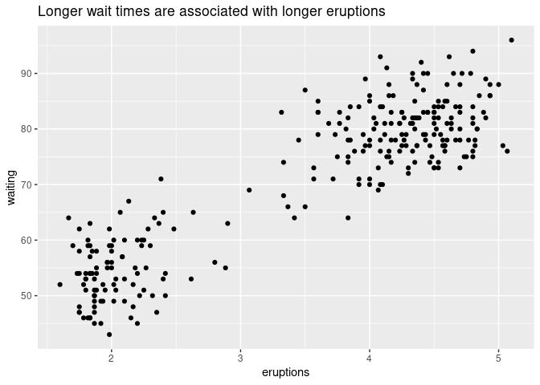
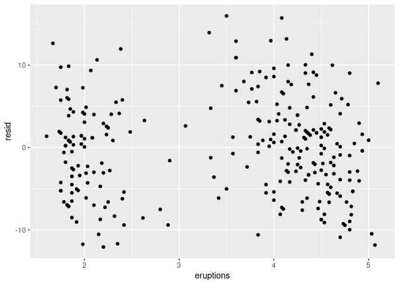
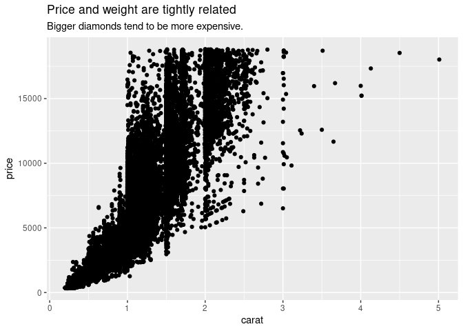

# Patterns

### Setup

``` r
library(tidyverse)
#> ── Attaching packages ─────────────────────────────────────── tidyverse 1.3.1 ──
#> ✓ ggplot2 3.3.5     ✓ purrr   0.3.4
#> ✓ tibble  3.1.6     ✓ dplyr   1.0.7
#> ✓ tidyr   1.1.4     ✓ stringr 1.4.0
#> ✓ readr   2.1.1     ✓ forcats 0.5.1
#> ── Conflicts ────────────────────────────────────────── tidyverse_conflicts() ──
#> x dplyr::filter() masks stats::filter()
#> x dplyr::lag()    masks stats::lag()
library(modelr)
```

### Insights

-   Patterns reveal covariation.

-   Covariation reduces uncertainty. If two variables covary:

    -   You can use one to better predict the second.
    -   If the relationship is causal (a special case), you can use one
        variable to control the second.

-   Models are a tool for extracting patterns out of data.

### Why poor-quality diamonds seem most expensive?

``` r
ggplot(diamonds, aes(cut, price)) + 
  geom_boxplot() + 
  labs(title = "The worst diamonds seem most expensive")
```

<!-- -->

It’s hard to understand the relationship between `cut` (quality) and
`price` because …

``` r
ggplot(diamonds, aes(cut, carat)) + 
  geom_boxplot() +
  labs(
    title = "Weight and quality are tightly related",
    subtitle = "Bigger diamonds tend to be of worse quality."
  )
```

<!-- -->

and …

``` r
ggplot(diamonds, aes(carat, price)) + 
  geom_point() +
  labs(
    title = "Price and weight are tightly related",
    subtitle = "Bigger diamonds tend to be more expensive."
  )
```

<!-- -->

-   Remove the relationship between price and weight.
-   Explore price vs. quality again.

``` r
mod <- lm(log(price) ~ log(carat), data = diamonds)

diamonds2 <- diamonds %>% 
  add_residuals(mod) %>% 
  mutate(resid = exp(resid))
  
ggplot(diamonds2, aes(cut, resid)) + 
  geom_boxplot() +
  labs(title = "Relative to their size, better diamonds are more expensive.")
```

<!-- -->

### Bonus

Longer `waiting` times are associated with longer `eruptions`

``` r
ggplot(faithful, aes(eruptions, waiting)) + 
  geom_point()
```

<!-- -->

Remove the pattern and plot again

``` r
mod <- lm(waiting ~ eruptions, data = faithful)

faithful %>% 
  modelr::add_residuals(mod) %>%
  mutate(resid = resid) %>%
  ggplot(aes(eruptions, resid)) + 
  geom_point()
```

<!-- -->
